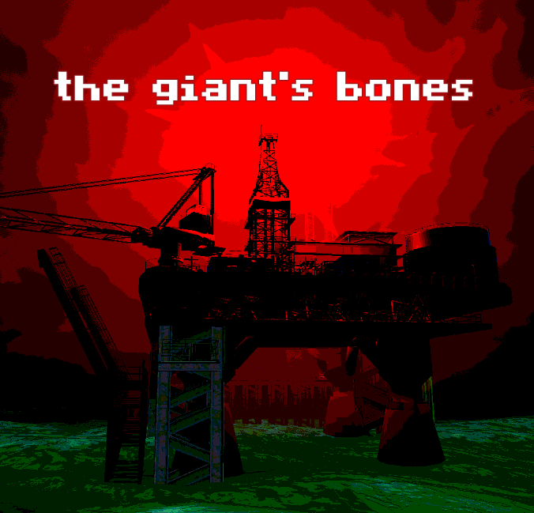
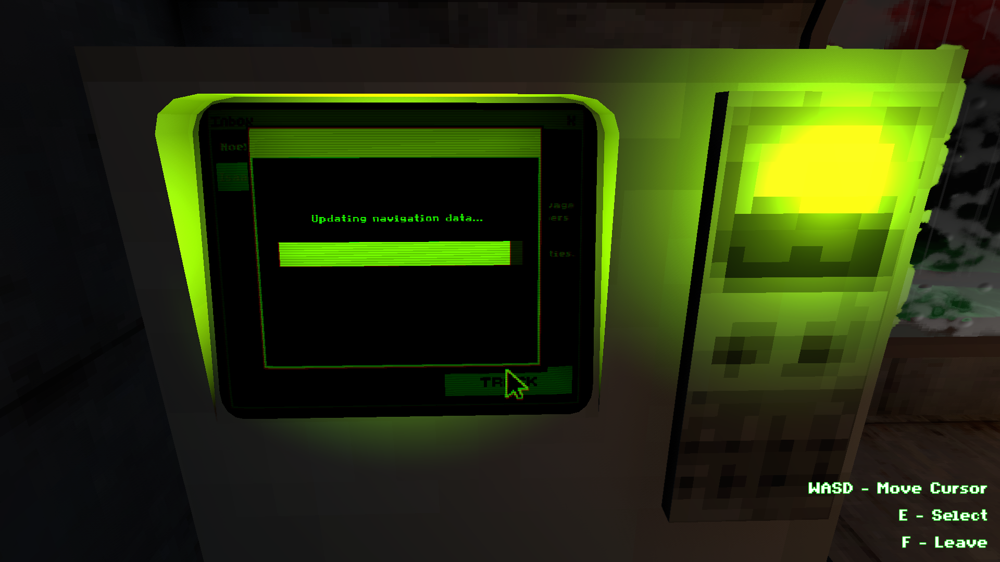
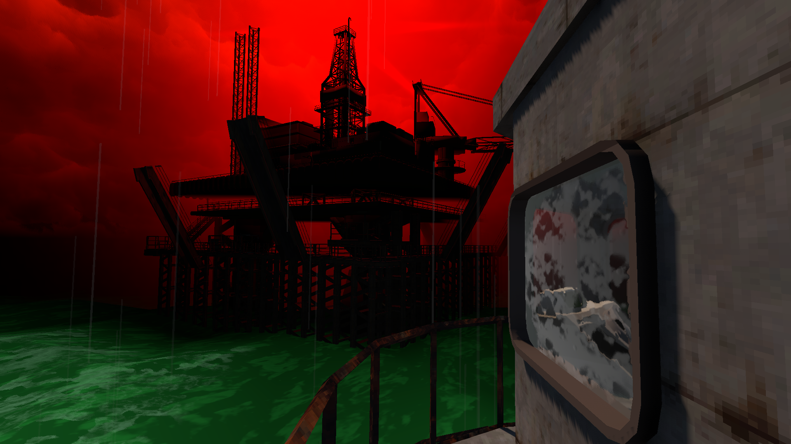
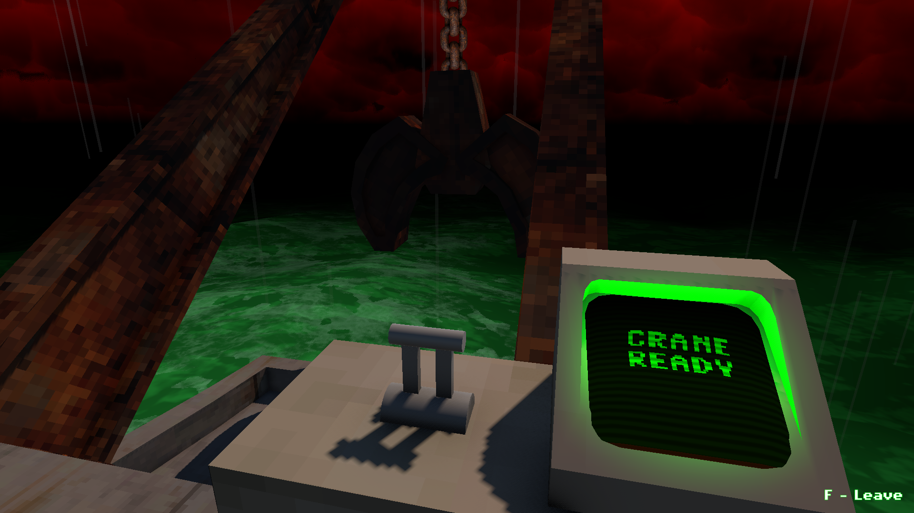

## Quick Overview

**Endless Sea** is the theme of the 23th edition of the themed horror game jam to which i'm participating, and the following is the result of a couple months of hard work by a very talented and passionate team.

In a world where machine and flesh intermingle, two great nations are locked in an arms race that leaves humanity teetering on the edge of oblivion.

As the captain of a repurposed salvage ship,  none of that concerns you. Your biggest worry is finding valuable scrap so you can pay your bills and feed your family. But as the affairs of the world loom larger, you soon find yourself pulled into their gravity.

The goal of the game is to create a disturbing post-apo sea ambiance through mundane activities portrayed as minigames.

## Appendix: Media & Links
##### The game : https://paodriscoll.itch.io/the-giants-bones
We'll try to add a fully working web build so you can play it on browser too :D

##### The submission page : https://itch.io/jam/themed-horror-game-jam-23/rate/4316015
##### The game jam : https://itch.io/jam/themed-horror-game-jam-23

### Key visuals

### Your work station

### An oil rig

### Your salvage crane

