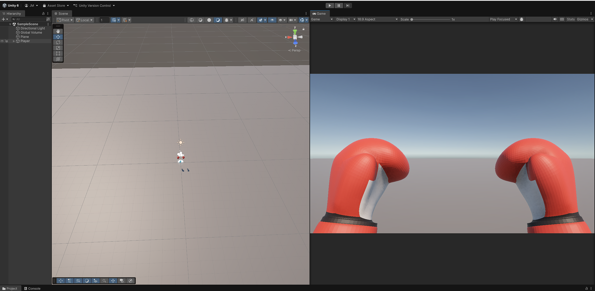
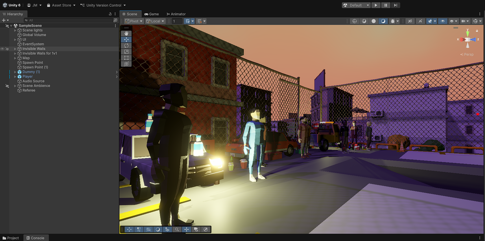
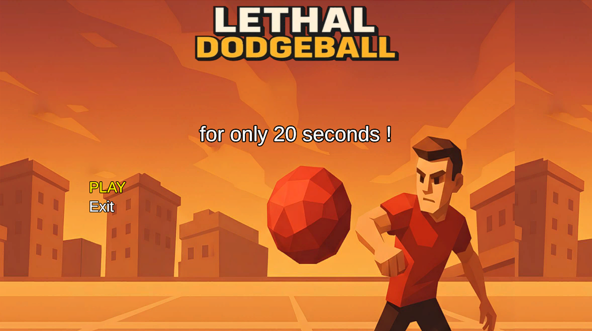

### How it started
The goal at first was to build a 20 seconds beat them up game with a focus on beating up as many NPCs as possible in a span of 20 seconds.

Throughout the prototyping, i tested projectiles and travel time to affect impact and damage, and after testing different sports balls assets, i figured the game would be more enjoyable with a variety of ammo as options, and after submitting the ideas to the rest of the team we decided to continue in that direction.

### A Dodgeball ?
Next step, throwing balls of different sorts using the unity physics system and aligning damage with velocity, aligning weight and handling impact. 

After acquiring decent results, i thought i would build a cool looking scene and map to test the projectiles in a live environment.

Result : i mishandled the dummy prefabs, AI, the balls go through some walls, and increase their speed at every ricochet !

A round of fixed later :

A ready scene, with functional physics, and an atmospheric undeground + sunset showdown vibe.

Now, the enemy dummy needs to move in an unpredictable manner, meaning a logical behavior with a random (chaotic) element.

A couple of bug fixes later ...

Why is it stuck halfway in the floor while calling for a bus you say ?

I didn't understand how prefabs and scene objects behaved back then, so i didn't notice that the character controller would be altered by the networking server, i left it that way because on build it would automatically spawn properly, and as a proud developed i felt like applying the good ol' *if it's broken but nobody sees it, then it's fine* 😎.

With the clock running, i left the simplistic UI as it was, and moved on to the game loop. I always knew how it would play out, dodgeball is straight forward, but i needed a win and lose state and thought of giving the crowd different reactions accordingly : 
Whenever a hit is scored, the crowd erupts in cheers, if the match ends with no deaths, they boo, if someone gets killed they explode.

I adding a death animation to the dummy and pushed it for the jam.

The game main menu was ready, and on windows build it would work fine, figures for reasons beyond me, it breaks on browser and needs to be adapted for js based frameworks.
I'm a web developer, that won't be an issue.

A few fixes later, the game is submitted to the 20 seconds game jam, and now we have to build the multiplayer version around server based collision detection, only issue is that my partner in crime's schedule got complicated with his new job, and i had other jams i wanted to work on...

