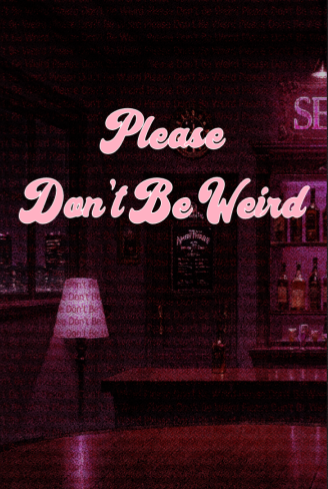

# Please Don't Be Weird - Game Design Document

## Quick Overview

**Please Don't Be Weird** is a conversation simulator centered on anxiety, the whole game loop revolves around a Visual Novel like conversation system where the protagonist gets a lot of intrusive thoughts and has to fight them off to keep the conversation going.

While trying the 20s gamejam submissions, i found and really enjoyed [this game](https://gabemcarvalho.itch.io/dont-stare), and felt inspired to build a similar game centered around having to fight off intrusive throughts.

### Gameplay Videos

https://youtu.be/yA4qePA79kI