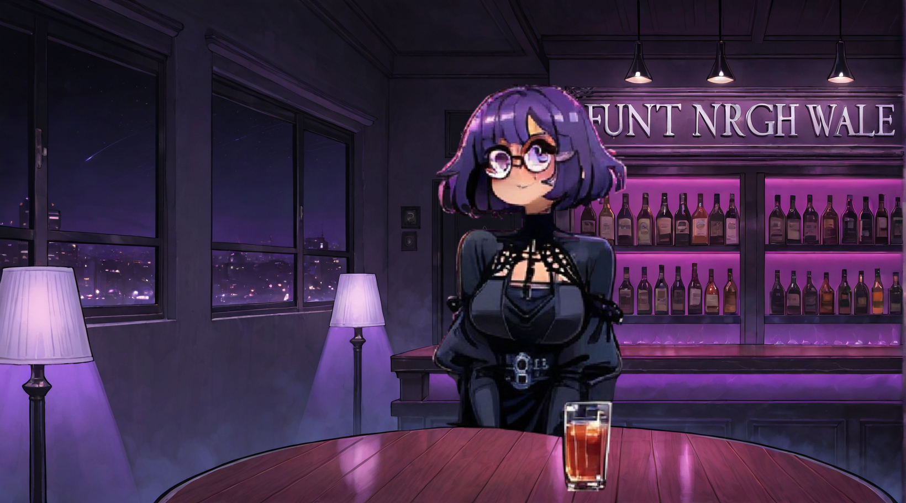

### Ideas behind the game

The core concept of the game is the one of holding a conversation with NPCs of different personalities and presence.
The first design idea was to create a cringe dating game after talking with a friend of mine about how far we've gone from cringe nerds who couldn't talk anything other then games and anime.

The NPCs are for now three core concepts : the mean girl, the shy girl and the outgoing girl.
Three girls as the game was going to be a dating game, until i realized i was aiming for the wrong playerbase, and that i'd have to build the narrative tree towards dating, which is not the end goal.

The three characters then were renamed : meanie, shy and outgoing. Each would pull different reactions from the player and create different situations where the player would need to understand the motors and boundaries of each and advance in propper dialogue and gain confidence in himself as he comes to listen to his own thoughts.

### Gameplay 
The initial game loop was about having to click on a dialogue line while other were moving around trying to get between the normal one and the cursor.
After writing some content, i decided creating a simple dialogue choice system was better for starter, and that mini games could be added later to create difficulty and engagement.

The player needs to keep a bunch of meters steady, feeding each *inner voice* enough to keep it alive while stopping it from overtaking him.

As the dialogue choices unravel, the NPC reacts based on their own traits gaining either negative interest or positive interest. Depending on the traits, the NPC could start engaging the player with their own conversations, and the roles would then be reversed.

Going with odd or antisocial behavior would heavily decrease the interest of the NPC in continuing the conversation, and being mean/disrespectful would get the player kicked from the bar as a game over.

The win conditions would be to finish a dialogue tree with a character and gaining enough confidence and control over the voices that we can continue to harder NPCs and conversations.

### The Fun factor
The fun factor is the humor of the conversations and the awkwardness of them, along with the gradual improvement of the player's stats and confidence meter.
Creating relatable situations help with the immersion and make for a satisfying discovery of who each character is beyond the generic design.

### The message of the game
The perception we have of others are usually a projection of ourselves and our own experiences, which can breed judgement or expectations.
Having genericly  designed characters and delving into who they really are as they grow conformable with the player is a way to push forward  the message : *just be yourself, and let others appreciate you for it (or not)*, which is in my humble opinion something that we've been losing with the high volumes of information we're being exposed to, along with social media preventing a real growth of social talents and socializing.

While nerds and geeks have traditionally struggled to take part in conversations and socialize, i feel creating a game that pushes people to breed the proper behavior towards that is ironic, but ... it might work ... and it might be as fun to play as it's fun to make :) 