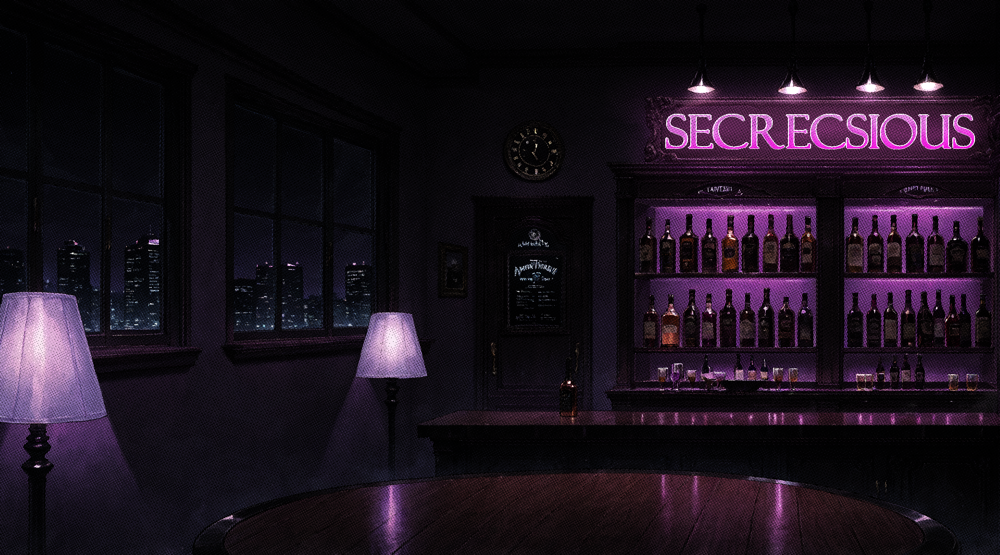

The first map and as of now the only map, is a modern pub with a rich *casual apartment* vibe, meant to look both cosy and familiar enough to feel safe in. 
In the background we have a bar with its name on top, multiple clients and other NPCs will eventually appear in it.

Through the window we can notice building pointing out how high we are, representing how far the player character got just by attending the social event, but also how hard he might be falling if he fails at socializing.

The map was designed and rendered on clip studio paint using 3d objects and with some textures found on the internet. 