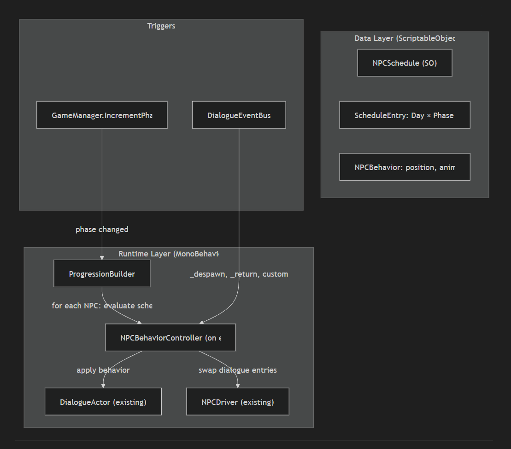

The first thing i worked on as i joined the game, was a core structure, scene and context manager.

Start a game, set graphic and audio settings, check for saves, load main menu accordingly.
When a game starts, load the right scene with the right context. When reaching the end of a game phase, save progress, load the next scene.

The established structure is very low level and could adapt to any project, the goal is to let the game flourish and grow without having to rewrite everything a every iteration.

[SIW - Main menu and rapid game loader demo](https://youtu.be/1r16yZGeceY)

## Dialogue System & NPC Lifecycle

We just completed a major architectural overhaul to bring the game's narrative systems up to AAA standards! We implemented a **Disco Elysium-style**, data-driven Dialogue System that supports branching choices, persistent game state flags, and one-shot events directly from a custom node graph editor. 

To complement this, we built a **Persona-style** Schedule-Based NPC Behavior system. Now, NPCs are fully aware of the game's Day/Phase cycle. They know exactly where to stand, which animation to play, and what dialogue to speak based on a schedule table (e.g., a character stands at their desk in the morning, but grabs coffee in the afternoon). Furthermore, dialogue choices can trigger runtime events to instantly override these schedules—if you tell an NPC to go home early during a chat, they will actually pack up and despawn on the spot!

Lastly, we implemented dynamic, multi-character camera staging for interactions. The camera smoothly calculates the shortest arc to automatically frame whoever is speaking during a conversation, creating cinematic shot-reverse-shot dialogue scenes without any hardcoded tracking. 

[SIW - Dialogue and behavior lifecycle demo](https://youtu.be/EpAeBCVfYV0)